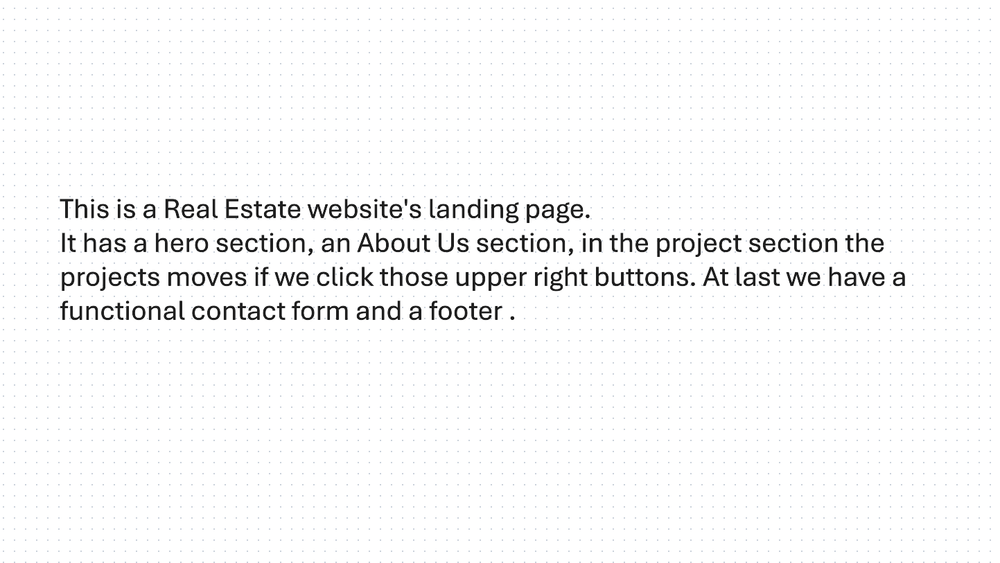
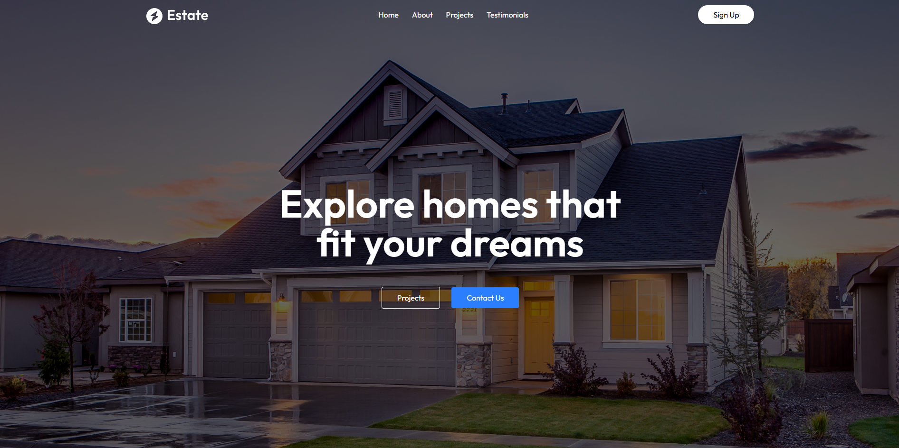
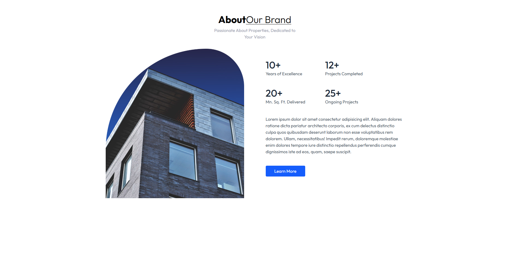
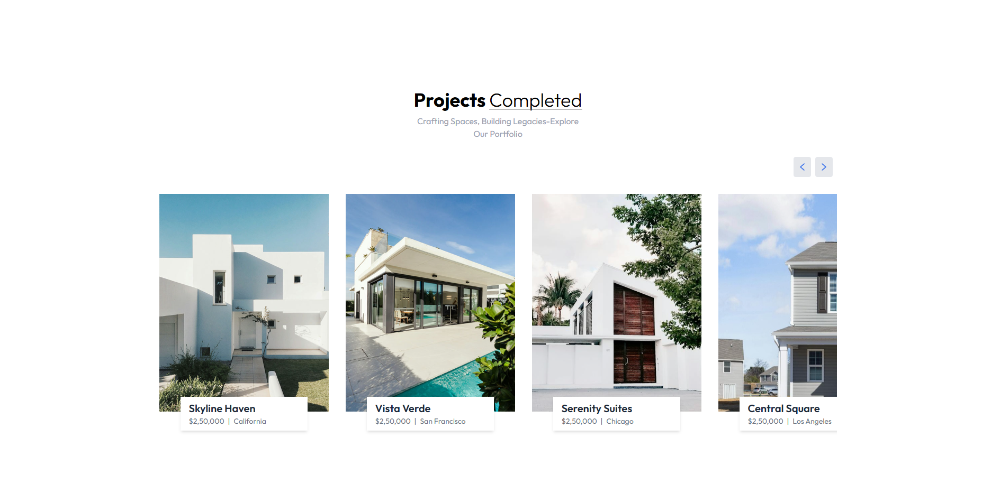
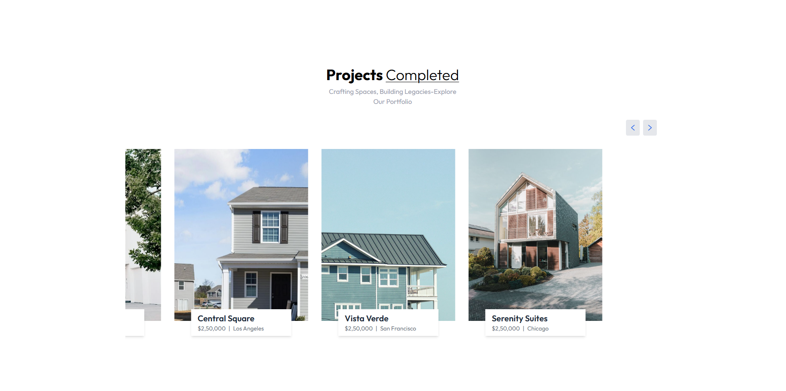
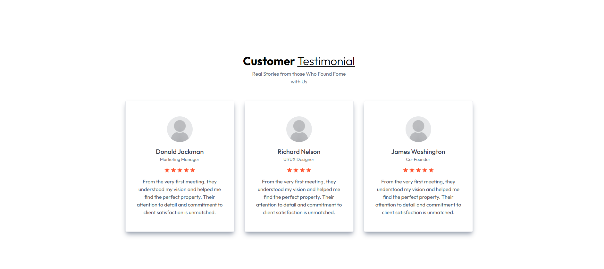
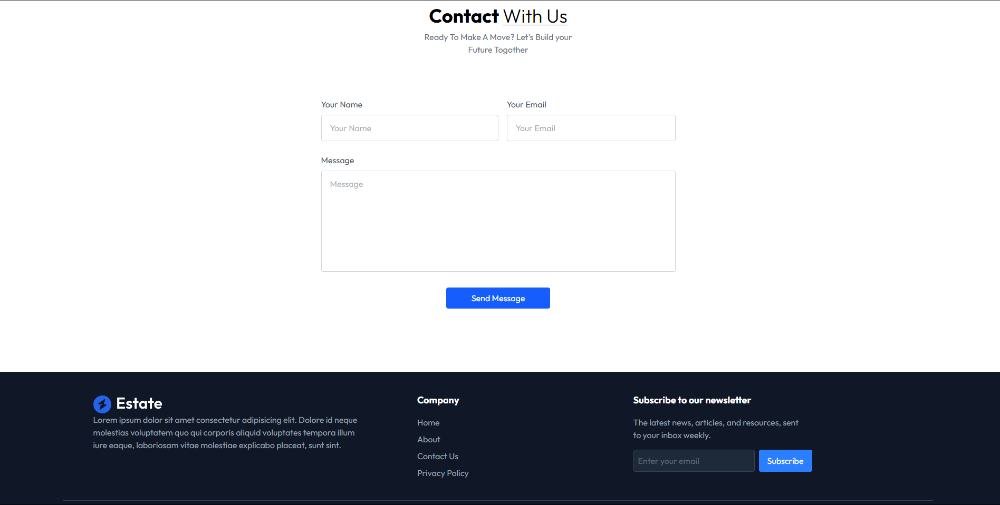

# Real Estate Landing Page 

A fully responsive real estate landing page built with React and Tailwind CSS. Clean UI with modern design, smooth user experience, and responsive across all devices.

## Live Demo
[Click Here to View](https://real-estate-website-green-two.vercel.app/)

## Tech Stack
- React
- Tailwind CSS
- JavaScript

## Features
- Fully responsive design (mobile, tablet, desktop)
- Smooth transitions and animations
- Modern UI layout
- Easy navigation
- Functional contact form
- The cards project section moves sideways when top right buttons are clicked

## Screenshots

### Intro


### Header Section


### About Us Section


### Portfolio Section


### Portfolio Section


### Reviews Section


### Contact and Footer Section


## Installation & Running Locally

```bash
git clone https://github.com/Iffti2000/Real-Estate-Website.git
cd Real-Estate-Website
npm install
npm start
